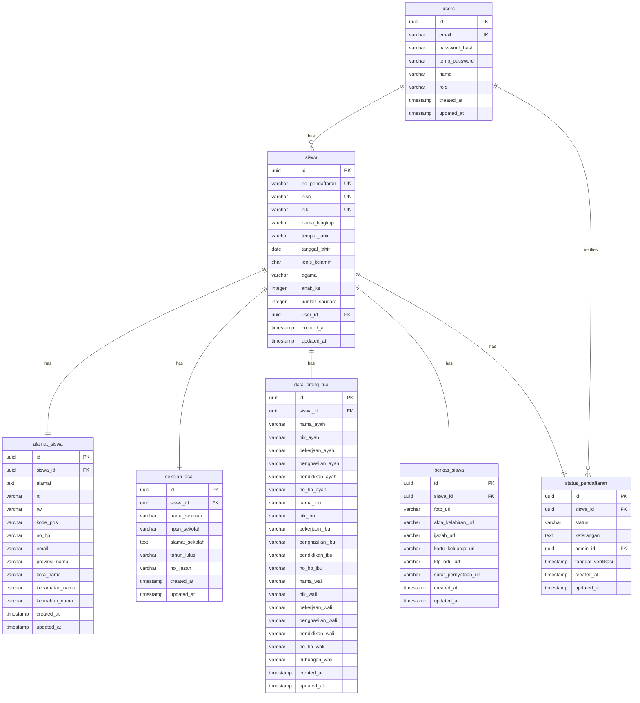

# Database ERD - PostgreSQL Schema

## Overview
Database schema untuk sistem PPDB (Penerimaan Peserta Didik Baru) MTsN 1 Way Kanan dengan fitur pendaftaran siswa, manajemen admin, dan sistem wilayah Indonesia.

## Entity Relationship Diagram



## Database Schema (PostgreSQL)

### 1. Users Table
```sql
CREATE TABLE users (
    id UUID PRIMARY KEY DEFAULT gen_random_uuid(),
    email VARCHAR(255) UNIQUE NOT NULL,
    password_hash VARCHAR(255) NOT NULL,
    temp_password VARCHAR(5), -- Temporary password for email sending
    nama VARCHAR(255) NOT NULL,
    role VARCHAR(20) NOT NULL CHECK (role IN ('siswa', 'admin')),
    created_at TIMESTAMP DEFAULT CURRENT_TIMESTAMP,
    updated_at TIMESTAMP DEFAULT CURRENT_TIMESTAMP
);

CREATE INDEX idx_users_email ON users(email);
CREATE INDEX idx_users_role ON users(role);
```

### 2. Siswa Table
```sql
CREATE TABLE siswa (
    id UUID PRIMARY KEY DEFAULT gen_random_uuid(),
    no_pendaftaran VARCHAR(20) UNIQUE NOT NULL,
    nisn VARCHAR(10) UNIQUE NOT NULL,
    nik VARCHAR(16) UNIQUE NOT NULL,
    nama_lengkap VARCHAR(255) NOT NULL,
    tempat_lahir VARCHAR(100) NOT NULL,
    tanggal_lahir DATE NOT NULL,
    jenis_kelamin CHAR(1) NOT NULL CHECK (jenis_kelamin IN ('L', 'P')),
    agama VARCHAR(50) NOT NULL,
    anak_ke INTEGER NOT NULL CHECK (anak_ke > 0),
    jumlah_saudara INTEGER NOT NULL CHECK (jumlah_saudara >= 0),
    user_id UUID REFERENCES users(id) ON DELETE CASCADE,
    created_at TIMESTAMP DEFAULT CURRENT_TIMESTAMP,
    updated_at TIMESTAMP DEFAULT CURRENT_TIMESTAMP
);

CREATE INDEX idx_siswa_no_pendaftaran ON siswa(no_pendaftaran);
CREATE INDEX idx_siswa_nisn ON siswa(nisn);
CREATE INDEX idx_siswa_nik ON siswa(nik);
CREATE INDEX idx_siswa_user_id ON siswa(user_id);
```

### 3. Alamat Siswa Table
```sql
CREATE TABLE alamat_siswa (
    id UUID PRIMARY KEY DEFAULT gen_random_uuid(),
    siswa_id UUID REFERENCES siswa(id) ON DELETE CASCADE,
    alamat TEXT NOT NULL,
    rt VARCHAR(3) NOT NULL,
    rw VARCHAR(3) NOT NULL,
    kode_pos VARCHAR(5) NOT NULL,
    no_hp VARCHAR(15) NOT NULL,
    email VARCHAR(255) NOT NULL,
    provinsi_nama VARCHAR(100) NOT NULL,
    kota_nama VARCHAR(100) NOT NULL,
    kecamatan_nama VARCHAR(100) NOT NULL,
    kelurahan_nama VARCHAR(100) NOT NULL,
    created_at TIMESTAMP DEFAULT CURRENT_TIMESTAMP,
    updated_at TIMESTAMP DEFAULT CURRENT_TIMESTAMP
);

CREATE INDEX idx_alamat_siswa_siswa_id ON alamat_siswa(siswa_id);
CREATE INDEX idx_alamat_siswa_provinsi ON alamat_siswa(provinsi_nama);
CREATE INDEX idx_alamat_siswa_kota ON alamat_siswa(kota_nama);
```

### 4. Sekolah Asal Table
```sql
CREATE TABLE sekolah_asal (
    id UUID PRIMARY KEY DEFAULT gen_random_uuid(),
    siswa_id UUID REFERENCES siswa(id) ON DELETE CASCADE,
    nama_sekolah VARCHAR(255) NOT NULL,
    npsn_sekolah VARCHAR(8) NOT NULL,
    alamat_sekolah TEXT NOT NULL,
    tahun_lulus VARCHAR(4) NOT NULL,
    no_ijazah VARCHAR(50) NOT NULL,
    created_at TIMESTAMP DEFAULT CURRENT_TIMESTAMP,
    updated_at TIMESTAMP DEFAULT CURRENT_TIMESTAMP
);

CREATE INDEX idx_sekolah_asal_siswa_id ON sekolah_asal(siswa_id);
CREATE INDEX idx_sekolah_asal_npsn ON sekolah_asal(npsn_sekolah);
```

### 5. Data Orang Tua Table
```sql
CREATE TABLE data_orang_tua (
    id UUID PRIMARY KEY DEFAULT gen_random_uuid(),
    siswa_id UUID REFERENCES siswa(id) ON DELETE CASCADE,
    nama_ayah VARCHAR(255) NOT NULL,
    nik_ayah VARCHAR(16) NOT NULL,
    pekerjaan_ayah VARCHAR(100) NOT NULL,
    penghasilan_ayah VARCHAR(50) NOT NULL,
    pendidikan_ayah VARCHAR(20) NOT NULL,
    no_hp_ayah VARCHAR(15) NOT NULL,
    nama_ibu VARCHAR(255) NOT NULL,
    nik_ibu VARCHAR(16) NOT NULL,
    pekerjaan_ibu VARCHAR(100) NOT NULL,
    penghasilan_ibu VARCHAR(50) NOT NULL,
    pendidikan_ibu VARCHAR(20) NOT NULL,
    no_hp_ibu VARCHAR(15) NOT NULL,
    nama_wali VARCHAR(255),
    nik_wali VARCHAR(16),
    pekerjaan_wali VARCHAR(100),
    penghasilan_wali VARCHAR(50),
    pendidikan_wali VARCHAR(20),
    no_hp_wali VARCHAR(15),
    hubungan_wali VARCHAR(50),
    created_at TIMESTAMP DEFAULT CURRENT_TIMESTAMP,
    updated_at TIMESTAMP DEFAULT CURRENT_TIMESTAMP
);

CREATE INDEX idx_data_orang_tua_siswa_id ON data_orang_tua(siswa_id);
```

### 6. Berkas Siswa Table
```sql
CREATE TABLE berkas_siswa (
    id UUID PRIMARY KEY DEFAULT gen_random_uuid(),
    siswa_id UUID REFERENCES siswa(id) ON DELETE CASCADE,
    foto_url VARCHAR(500),
    akta_kelahiran_url VARCHAR(500),
    ijazah_url VARCHAR(500),
    kartu_keluarga_url VARCHAR(500),
    ktp_ortu_url VARCHAR(500),
    surat_pernyataan_url VARCHAR(500),
    created_at TIMESTAMP DEFAULT CURRENT_TIMESTAMP,
    updated_at TIMESTAMP DEFAULT CURRENT_TIMESTAMP
);

CREATE INDEX idx_berkas_siswa_siswa_id ON berkas_siswa(siswa_id);
```

### 7. Status Pendaftaran Table
```sql
CREATE TABLE status_pendaftaran (
    id UUID PRIMARY KEY DEFAULT gen_random_uuid(),
    siswa_id UUID REFERENCES siswa(id) ON DELETE CASCADE,
    status VARCHAR(20) NOT NULL CHECK (status IN ('pending', 'verified', 'rejected', 'accepted')),
    keterangan TEXT,
    admin_id UUID REFERENCES users(id),
    tanggal_verifikasi TIMESTAMP,
    created_at TIMESTAMP DEFAULT CURRENT_TIMESTAMP,
    updated_at TIMESTAMP DEFAULT CURRENT_TIMESTAMP
);

CREATE INDEX idx_status_pendaftaran_siswa_id ON status_pendaftaran(siswa_id);
CREATE INDEX idx_status_pendaftaran_status ON status_pendaftaran(status);
CREATE INDEX idx_status_pendaftaran_admin_id ON status_pendaftaran(admin_id);
```


## Triggers and Functions

### Update Timestamp Trigger
```sql
CREATE OR REPLACE FUNCTION update_updated_at_column()
RETURNS TRIGGER AS $$
BEGIN
    NEW.updated_at = CURRENT_TIMESTAMP;
    RETURN NEW;
END;
$$ language 'plpgsql';

-- Apply trigger to all tables
CREATE TRIGGER update_users_updated_at BEFORE UPDATE ON users FOR EACH ROW EXECUTE FUNCTION update_updated_at_column();
CREATE TRIGGER update_siswa_updated_at BEFORE UPDATE ON siswa FOR EACH ROW EXECUTE FUNCTION update_updated_at_column();
CREATE TRIGGER update_alamat_siswa_updated_at BEFORE UPDATE ON alamat_siswa FOR EACH ROW EXECUTE FUNCTION update_updated_at_column();
CREATE TRIGGER update_sekolah_asal_updated_at BEFORE UPDATE ON sekolah_asal FOR EACH ROW EXECUTE FUNCTION update_updated_at_column();
CREATE TRIGGER update_data_orang_tua_updated_at BEFORE UPDATE ON data_orang_tua FOR EACH ROW EXECUTE FUNCTION update_updated_at_column();
CREATE TRIGGER update_berkas_siswa_updated_at BEFORE UPDATE ON berkas_siswa FOR EACH ROW EXECUTE FUNCTION update_updated_at_column();
CREATE TRIGGER update_status_pendaftaran_updated_at BEFORE UPDATE ON status_pendaftaran FOR EACH ROW EXECUTE FUNCTION update_updated_at_column();
```

### Generate Registration Number Function
```sql
CREATE OR REPLACE FUNCTION generate_no_pendaftaran()
RETURNS TRIGGER AS $$
BEGIN
    NEW.no_pendaftaran := 'PPDB' || TO_CHAR(CURRENT_DATE, 'YYYY') || LPAD(nextval('siswa_no_seq')::text, 4, '0');
    RETURN NEW;
END;
$$ language 'plpgsql';

-- Create sequence for registration number
CREATE SEQUENCE siswa_no_seq START 1;

-- Apply trigger
CREATE TRIGGER generate_no_pendaftaran_trigger 
    BEFORE INSERT ON siswa 
    FOR EACH ROW 
    EXECUTE FUNCTION generate_no_pendaftaran();
```

### Generate Password Function
```sql
CREATE OR REPLACE FUNCTION generate_password()
RETURNS TEXT AS $$
DECLARE
    chars TEXT := 'ABCDEFGHIJKLMNOPQRSTUVWXYZabcdefghijklmnopqrstuvwxyz0123456789';
    password TEXT := '';
    i INTEGER;
BEGIN
    FOR i IN 1..5 LOOP
        password := password || substr(chars, floor(random() * length(chars) + 1)::integer, 1);
    END LOOP;
    RETURN password;
END;
$$ language 'plpgsql';

-- Pastikan ekstensi pgcrypto aktif
CREATE EXTENSION IF NOT EXISTS pgcrypto;

-- Buat ulang fungsi
CREATE OR REPLACE FUNCTION hash_password(raw_password TEXT)
RETURNS TEXT AS $$
BEGIN
    -- Gunakan bcrypt hashing dengan salt acak
    RETURN crypt(raw_password, gen_salt('bf'));
END;
$$ LANGUAGE plpgsql;

-- Aktifkan ekstensi dulu (sekali saja)
CREATE EXTENSION IF NOT EXISTS pgcrypto;

-- Hash password baru
SELECT hash_password('rahasia123');

-- Hasil contoh:
-- $2a$10$0LZfJzNRXbq9tNQOcy7s7uFukqL1bKjX.MCG1FiUe5A.3cDP8Z6E6

-- Simpan ke tabel users
INSERT INTO users (email, password_hash, nama, role)
VALUES ('user@example.com', hash_password('rahasia123'), 'User 1', 'siswa');

SELECT *
FROM users
WHERE email = 'user@example.com'
  AND password_hash = crypt('rahasia123', password_hash);

-- Trigger to auto-generate password for new users
CREATE OR REPLACE FUNCTION auto_generate_user_password()
RETURNS TRIGGER AS $$
DECLARE
    generated_password TEXT;
BEGIN
    -- Only generate password if not provided (for new registrations)
    IF NEW.password_hash IS NULL OR NEW.password_hash = '' THEN
        generated_password := generate_password();
        NEW.password_hash := hash_password(generated_password);
        
        -- Store plain password temporarily for email sending
        -- In production, this should be handled by backend application
        NEW.temp_password := generated_password;
    END IF;
    RETURN NEW;
END;
$$ language 'plpgsql';

-- Add temp_password column for email sending
ALTER TABLE users ADD COLUMN temp_password VARCHAR(5);

-- Apply trigger
CREATE TRIGGER auto_generate_user_password_trigger 
    BEFORE INSERT ON users 
    FOR EACH ROW 
    EXECUTE FUNCTION auto_generate_user_password();
```

## Sample Data

### Insert Sample Admin User
```sql
INSERT INTO users (email, password_hash, nama, role) VALUES 
('admin@mtsn1wk.sch.id', '$2a$10$hash...', 'Administrator', 'admin');
```

### Reset PPDB Seq
``` sql
SELECT setval('siswa_no_seq', 1, false);
```

## Notes

1. **UUID vs SERIAL**: Menggunakan UUID untuk primary key pada tabel utama untuk keamanan dan scalability
2. **Foreign Key Constraints**: Semua relasi menggunakan CASCADE DELETE untuk konsistensi data
3. **Indexes**: Dibuat index pada kolom yang sering digunakan untuk query
4. **Constraints**: Menggunakan CHECK constraints untuk validasi data
5. **Triggers**: Automatic timestamp update dan generation of registration number
6. **Normalization**: Data dibagi menjadi beberapa tabel untuk menghindari redundancy
7. **Security**: Password di-hash menggunakan bcrypt atau algoritma sejenis
8. **Audit Trail**: Setiap tabel memiliki created_at dan updated_at untuk tracking
9. **Separate Database**: Database wilayah (provinsi, kota, kecamatan, kelurahan) terpisah dan sudah ada
10. **Denormalized Address**: Menyimpan nama wilayah sebagai string untuk kemudahan query dan independensi
11. **Auto-Generated Password**: Password 5 digit (huruf+angka, case sensitive) auto-generate saat register
12. **Email Integration**: Password dikirim via Mailgun setelah pendaftaran berhasil
13. **Temporary Password Storage**: Kolom temp_password untuk menyimpan plain password sebelum dikirim email

## Database Architecture

### PPDB Database (Internal)
- `users` - Manajemen user sistem
- `siswa` - Data siswa pendaftar
- `alamat_siswa` - Alamat siswa (denormalized)
- `sekolah_asal` - Data sekolah asal
- `data_orang_tua` - Data orang tua/wali
- `berkas_siswa` - File dokumen
- `status_pendaftaran` - Status verifikasi

### Wilayah Database (External/Shared)
- `provinsi` - Data provinsi Indonesia
- `kota` - Data kota/kabupaten
- `kecamatan` - Data kecamatan
- `kelurahan` - Data kelurahan/desa

## API Endpoints Mapping

- `GET /api/wilayah/provinsi` → Query ke database wilayah terpisah
- `GET /api/wilayah/kota?provinsi_id=X` → Query ke database wilayah terpisah
- `GET /api/wilayah/kecamatan?kota_id=X` → Query ke database wilayah terpisah
- `GET /api/wilayah/kelurahan?kecamatan_id=X` → Query ke database wilayah terpisah
- `POST /api/siswa/pendaftaran` → Insert ke semua tabel PPDB database + Auto-generate password + Kirim email
- `GET /api/admin/pendaftar` → Join query semua tabel PPDB database
- `PUT /api/admin/verifikasi/:id` → Update status_pendaftaran di PPDB database
- `POST /api/upload/berkas` → Terima file dari frontend | Simpan ke folder /berkas-ppdb/ | Return URL file
- `POST /api/auth/login` → Login dengan email + password (auto-generated)
- `POST /api/auth/forgot-password` → Reset password + Kirim email baru
